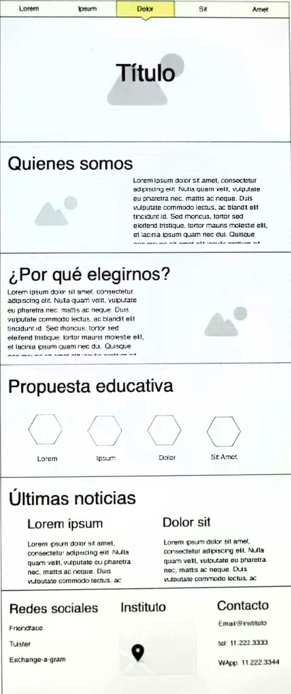

# _Proyecto Integrador Web Untrefschool_

## El proyecto pretende poner en práctica los lenguajes aprendidos durante el primer semestre del curso Frontend dictado por la Untref.

Se debe realizar ajustándose al diseño indicado por la Untref.
Las herramientas utilizadas son
HTML y CSS, Bootstap y Sass.

## Untrefschool:

Consta de una página con secciones desde la que se puede acceder a través de la barra de navegación y un pie de página con información sobre redes.

- Barra de navegación
- Secciones:
  - ¿Quiénes somos?
  - Sección ¿Por qué elegirnos?
  - Sección Porpuesta educatica
  - Últimas Noticias

* Footer

Autor: _Elena Bozzo_

Estado actual: _en desarrollo_
